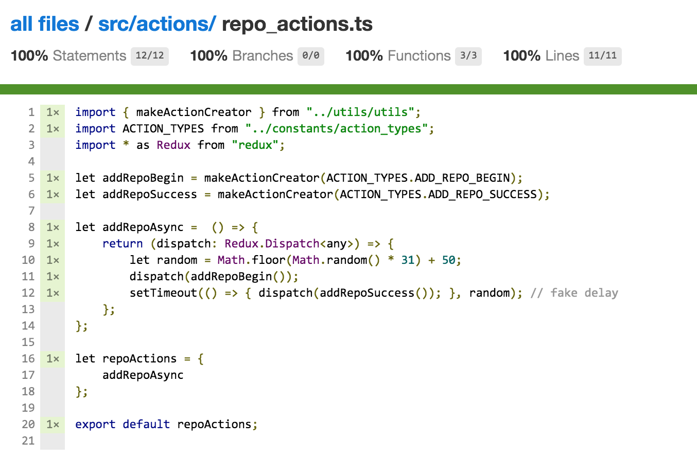
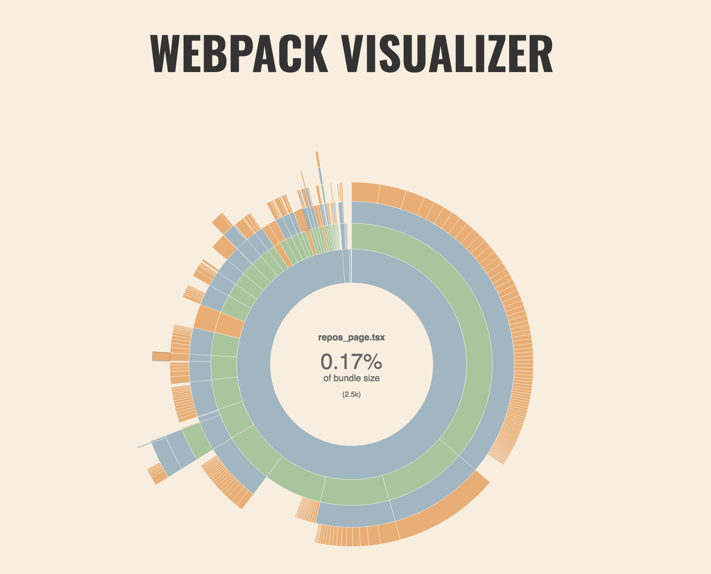

# redux-bootstrap-example

[](https://gitter.im/redux-bootstrap/redux-bootstrap?utm_source=badge&utm_medium=badge&utm_campaign=pr-badge&utm_content=badge)
[](https://travis-ci.org/redux-bootstrap/redux-bootstrap-example)
[](https://david-dm.org/redux-bootstrap/redux-bootstrap-example#info=dependencies)
[](https://david-dm.org/redux-bootstrap/redux-bootstrap-example/#info=devDependencies)

An example to showcase how to use [redux-bootstrap](https://github.com/redux-bootstrap/redux-bootstrap).

## How to run this example?

> :warning: Please ensure that you are using the latest version of Node.js.

To build and run this example you will need to do the following:

Install the Webpack development server:

```
$ npm install -g webpack-dev-server
```

Clone the repository:

```
$ git clone https://github.com/redux-bootstrap/redux-bootstrap-example.git
```

Move into the project:

```
$ cd redux-bootstrap-example
```

Install node modules:

```
$ npm install
```

Build and run the project:

```
$ npm start
```

Open a web browser and navigate to the following URL:

```
http://127.0.0.1:8080/
```

## How to run the unit tests?

You can run the tests using the following command:

```
$ npm test
```

A test coverage report is available under the `coverage` folder:



## How to see the bundle stats?

You can see the bundle stats using the following command:

```
$ npm run stats
```

A bundle size report will be displayed on screen:



## How to create a production bundle?
You can create a production-ready bundle using the following command:

```
$ npm run release
```

## TODOs
We have plans to try to fix the following items:

- [ ] Enable server-side rendering

## Questions & issues
Please use the [redux-bootstrap issues page](https://github.com/redux-bootstrap/redux-bootstrap/issues) 
instead of the issues page in this repo. If you have any questions about this example or the usage 
of redux-bootstrap.
